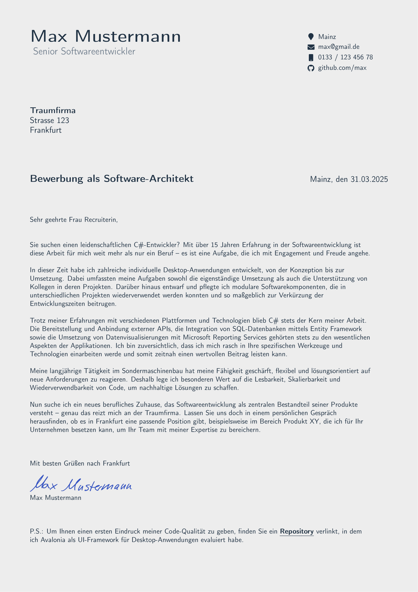
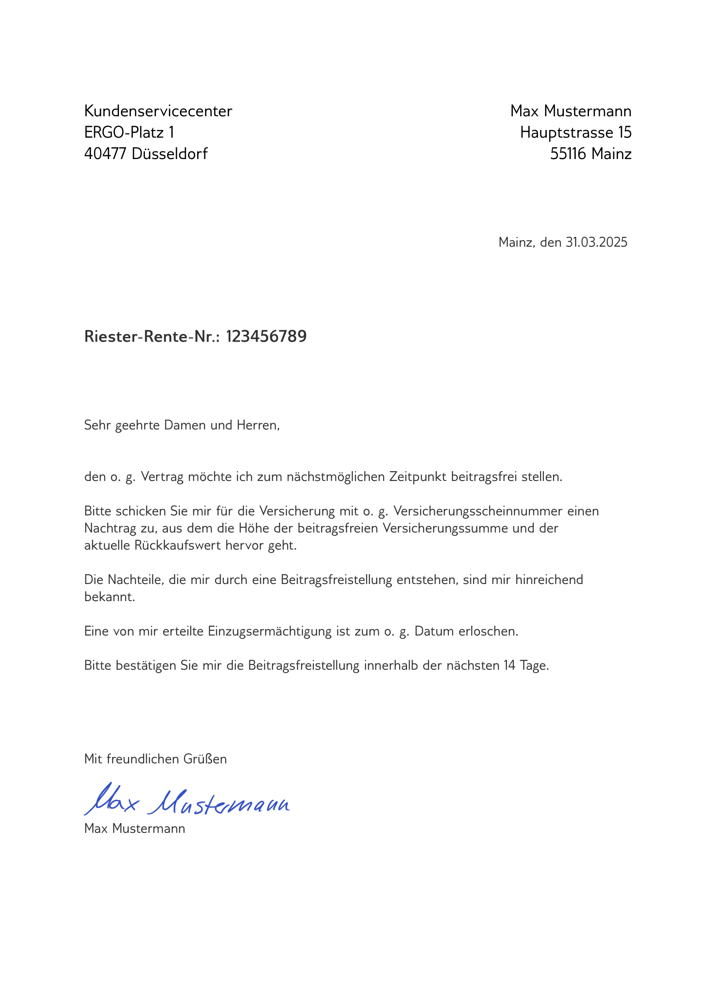

This is a razor web page to create a CV based on inputs.
The document creation is implemented by using a LaTeX template where the inputs are fed into and pdflatex is used to render the pdf.

It is also possible to create a formal letter.

