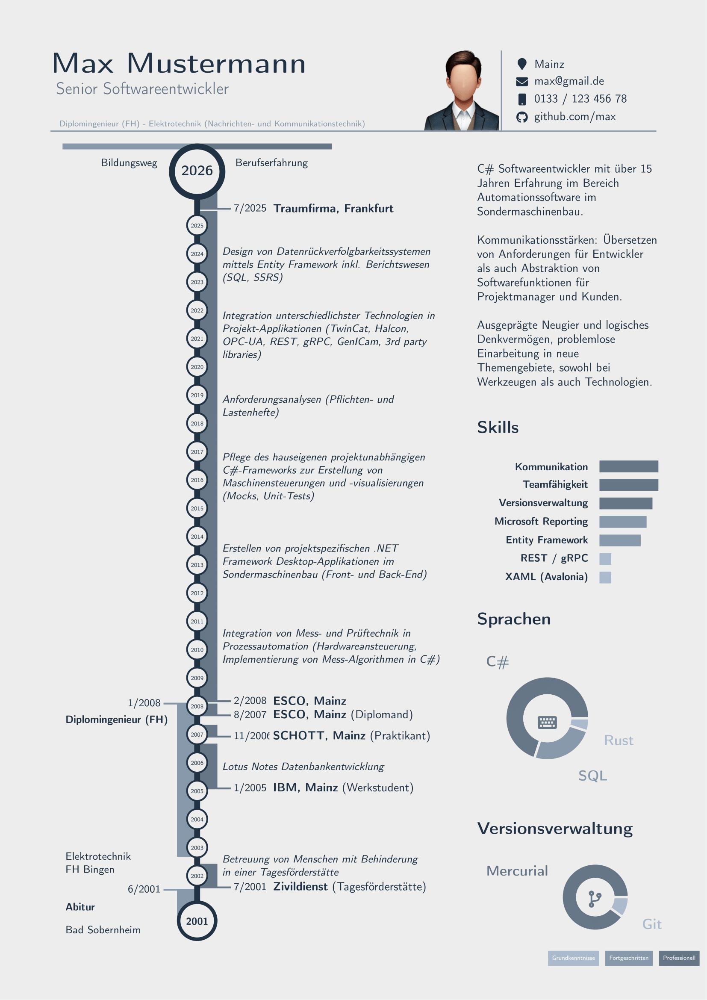

# Description

This is a razor web page to create a CV based on inputs.
The document creation is implemented by using a LaTeX template where the inputs are fed into and pdflatex is used to render the pdf.




It is also possible to create a formal letter.


# Installation

- Clone/download the repository
- Build the .NET 8 solution in your IDE and for your build target of choice.
- Deploy the published files to your target system
- Install texlive full
- create a service

```
sudo apt-get install texlive-full
```